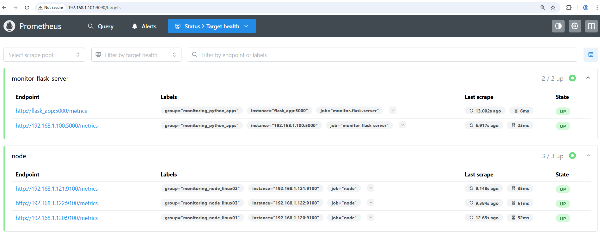

# Infrastructure & Python Flask Apps Monitoring with Prometheus and Grafana
DevOps project for monitoring of Linux servers (Lubuntu) and Python Flask apps with usage of Prometheus and Node Exporter.

### System Diagram


### General Overview
The purpose of this project is to monitor Linux servers with `node exporter` and Python app with `prometheus_flask_exporter` and aggregate their metrics in Prometheus server.
The whole project is implemented using Docker. The metrics are then presented on Grafana.

### Prepare Linux server (Lubuntu) to emit Prometheus metrics
Execute the following procedure on each linux server, which should be monitored by Prometheus.<br><br>


Install Node Exporter:
```
wget https://github.com/prometheus/node_exporter/releases/download/v1.0.1/node_exporter-1.0.1.linux-amd64.tar.gz
```
<br>

Create user:
```
sudo groupadd -f node_exporter
sudo useradd -g node_exporter --no-create-home --shell /bin/false node_exporter
sudo mkdir /etc/node_exporter
sudo chown node_exporter:node_exporter /etc/node_exporter
```
<br>


Unpack the downloaded package:
```
tar -xvf node_exporter-1.0.1.linux-amd64.tar.gz
mv node_exporter-1.0.1.linux-amd64 node_exporter-files
```
<br>


Install Node Exporter:
```
sudo cp node_exporter-files/node_exporter /usr/bin/
sudo chown node_exporter:node_exporter /usr/bin/node_exporter
```
<br>

Setup the Node Exporter service:
```
sudo nano /usr/lib/systemd/system/node_exporter.service
```

```
[Unit]
Description=Node Exporter
Documentation=https://prometheus.io/docs/guides/node-exporter/
Wants=network-online.target
After=network-online.target

[Service]
User=node_exporter
Group=node_exporter
Type=simple
Restart=on-failure
ExecStart=/usr/bin/node_exporter \
  --web.listen-address=:<PORT> 

[Install]
WantedBy=multi-user.target
```

Where `<PORT>` is set to 9100 for all Linux server in this project.
<br>
<br>

Reload Systemd:
```
sudo systemctl daemon-reload 
sudo systemctl start node_exporter
```
<br>

Enable node exporter on startup:
```
sudo systemctl enable node_exporter.service
```
<br>

Verify the node exporter is running:
```
http://<node_exporter-ip>:9100/metrics
```
<br>


### Prepare Python Flask app to emit Prometheus metrics
Inside `/src` there is a simple Flask app which runs as Docker container.


Importing the module:
```
from prometheus_flask_exporter import PrometheusMetrics
```

and adding another two lines of code:
```
metrics = PrometheusMetrics.for_app_factory()
metrics.init_app(app)
```
enables metrics support for Prometheus.

<br>


### Build docker image for the Flask app:
```
cd /src
sudo docker build --tag flask_app:0.0.1 .
```
<br>

### Configure Prometheus
The file `prometheus.yml` contains definitions of targets which emits metrics with node exporter.
In this project these are Lubuntu servers with IP addresses: `192.168.1.120`, `192.168.1.121` and `192.168.1.120`.

The Flask App is configured in separate Prometheus job and its target is Docker container service name.

Additionally there is also target `192.168.1.100:5000` whichs point to external running Flask application (non Docker).

<br>

### Configure docker compose
The file `docker-compose.yml` includes configuration of all containers needed for the project.

It requires also Docker network to be created:
```
docker network create monitor
```
<br>

### Start the monitoring stack
Inside root folder of the project, start the `docker-compose`:
```
docker-compose up -d
```
<br>


After the docker-compose stack is launched successfully it’s possible to launch Prometheus UI under the address:

`http://<IP-address>:9090`  where `<IP-address>` is the Prometheus server IP address

Then navigate to `Status->Target Health` to see if all endpoints are accessible.



Metrics query can be executed under `Query` button.
Some useful queries for node exporter are for instance:

`node_cpu_seconds_total`
`node_cpu_seconds_total{instance="192.168.1.120:9100"}`
<br>
<br>

Navigate to Grafana under:

`http://<IP-address>:3000`

Login with `admin` and `admin`. Credentials should be changed after first log-in. 

Add Prometheus data source:

Where server URL is the Docker container name of the Prometheus.

<br>

Next, under Dashboards, import dashboard with the `ID=1860`.

After it’s imported, we can discover metrics from each Linux server by selecting respective Nodename and Instance:


<br>

We see for instance an increase in ICMP trendline when huge amount of payload are sent by ICMP (ping) to one server:

<br>

Another examples of CPU, memory and disk space usage:

<br>

### Monitor Python Flask App with Prometheus

`GET` request to Flask app can be generated using Postman:

Flask app sends back a JSON payload with product data.
<br>

`POST` request requires proper body in `JSON` format:

<br>

Update of some entry in products is possible with `PUT` request and proper body in `JSON` format:

<br>

Using different metrics with proper filtering, important data about Flask app request‘s behaviour can be evaluated:

`flask_http_request_total`

`flask_http_request_duration_seconds_count`


<br>

There is dedicated Grafana dashboard called `Python Apps Monitor` with Flask metrics:


This way we can observe and monitor the Flask Python app.

<br>

### Stop the monitoring stack
Inside root folder of the project, stop the `docker-compose`:
```
docker-compose down
```
<br>